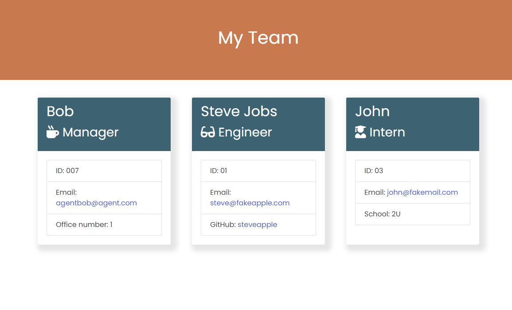
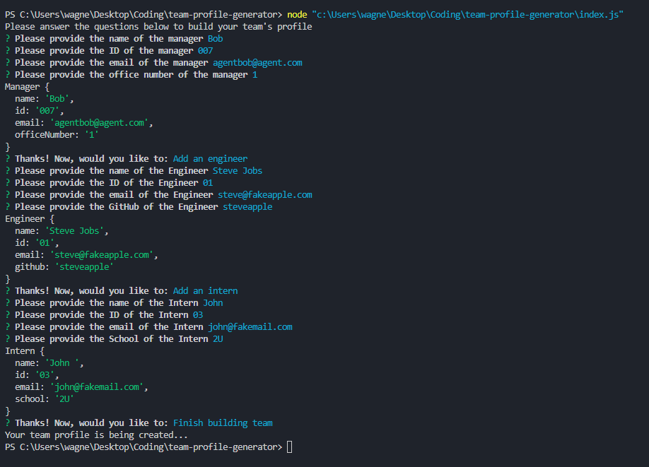

# Week 12 Challenge: Team Profile Generator 

## Description

My task is to take the given starter code and convert it into a working Node.js command-line application. I will create an application that takes in information about employees on a software engineering team and generates an HTML webpage that displays summaries for each person. The provided tests will be used to ensure that every part of my code passes.

## Table of contents

- [User Story](#user-story)
- [Preview of work](#preview-of-work)
- [Usage](#usage)
- [Resources](#resources)
- [Questions](#questions)
- [License](#license)

## User Story

- As a manager a user want to generate a webpage that displays my team's basic info so that a user have quick access to their emails and GitHub profiles.

## Preview of work 

  

### Prompts

  

### Tests

  
  
## Usage

Please open the index.js file in the main folder, run the node index.js within the command line and answer the questions.

## Resources

Validating Emails:
- https://stackoverflow.com/questions/65189877/how-can-i-validate-that-a-user-input-their-email-when-using-inquirer-npm

Checking for directories and files with fs:
- https://www.geeksforgeeks.org/node-js-fs-mkdirsync-method/

- https://www.geeksforgeeks.org/node-js-fs-existssync-method/

## Questions

If you have any questions please contact me at wagnerolarco@gmail.com or if check me out on GitHub at https://github.com/wagnerona

## License

Please refer to the MIT license if you are using any information provided in this repo. 

Copyright (c) 2023 wagnerona

